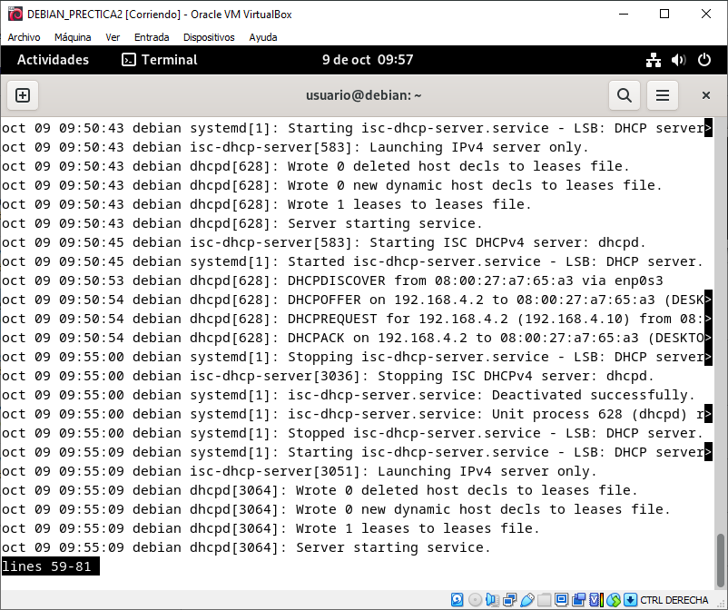

# Práctica 2: Instalación y configuración de servidor y cliente DHCP en Debian.

## INDICE

[1.- INTRODUCCION](#introduccion)  
[2.- RECURSOS](#recursos)  
[3.- CONFIGURAR TARJETA DE RED](#configurar-tarjeta-de-red)  
[4.- CAMBIAR A SUPER USUARIO](#cambiar-a-super-usuario)  
[5.- INSTALACION DE PAQUETE](#instalacion-de-paquete)
[6.- CONFIGURACION](#configuracion)  
[7.- CONFIGURACION DEL DHCP](#configuracion-del-dhcp)  
[8.- COMPRABAR DHCP](#comprabar-dhcp)  
[9.- COMPPROBACION DEL CLIENTE CON RESERVA](#compprobacion-del-cliente-con-reserva)  
[10.- COMPPROBACION DEL CLIENTE SIN RESERVA](#comprobacion-del-cliente-sin-reserva)  
[11.- IP EQUIPOS](#ip-equipos)  
[12.- LOGS DE FALLO](#logs-de-fallos)


## INTRODUCCION:   

```
Esta actividad consiste en realizar un tutorial en el que se describan los ficheros involucrados y los comandos necesarios para configurar el servidor isc-dhcp-server en Debian. Este tutorial se realizará en lenguaje Markdown y será publicado en GitHub.  
```

## RECURSOS:  

o	PC con acceso a Internet y paquete ofimático instalado.  
o	VirtualBox.  
o	Debian.  
o	Windows cliente.  
o	pfSense.  
o	https://github.com/  
o	Visual Studio Code.   

## CONFIGURAR TARJETA DE RED: 

### EXPLICACION:

```
En las captura siguiente se va a mostrar la configuración de la tarjeta de red mediante interfaz grafica de la maquina debian12 que previamente esta instalada.
```

### DEMOSTRACION:

Configuracion Pfsense:  

configuracion Debian:   


## CAMBIAR A SUPER USUARIO:  

### EXPLICACION:

```
Se va ha cambiar a el superusuario para poder instalar el servicio, utilizaremos el comando "su -".
```

### DEMOSTRACION:


## INSTALACION DE PAQUETE:  

### EXPLICACION:

```
En este apartado vamos ha instalar el paquete dhcp.
```

### DEMOSTRACION:


## CONFIGURACION:  

### EXPLICACION:

```
Configuración de la interfaz por la que va ha escuchar.
```

### DEMOSTRACION:


## CONFIGURACION DEL DHCP:  

### EXPLICACION:

```
A continuación, vamos ha modificar el archivo dhcpd.conf para configurar el servicio dhcp.
```

### DEMOSTRACION:

Realizamos una copia del archivo dhcpd.conf:  
    

Configuramos las opciones del dhcp:
   

Configuración de la reserva de ip:
  

## COMPRABAR DHCP:  

### EXPLICACION:

```
Comprobación del estado del servidor dhcp.
```

### DEMOSTRACION:


  

## COMPPROBACION DEL CLIENTE CON RESERVA:  

### EXPLICACION:

```
Comprobación en el cliente con reserva.
```

### DEMOSTRACION:


## COMPROBACION DEL CLIENTE SIN RESERVA:  

### EXPLICACION:

```
Comprobación en el cliente sin reserva
```

### DEMOSTRACION:


## IP EQUIPOS:

|Equipo|Nombre|Ip Interna|Ip Externa|
|:----:|:----:|:----:|:----:|
|Pfsense|PFSENSE_SRI|192.168.4.1/24|10.0.16.92/24|
|Debian12|DEBIAN_PRECTICA2|192.168.4.10/24|---|
|Windows10_1|CLIENTEW10_SRI|192.168.4.91/24|---|
|Windows10_2|CLIENTEW10_SRI_2|192.168.4.2/24|---|

## LOGS DE FALLOS:

### EXPLICACION:

```
Aqui se ve la instalacion, el filtrado de los logs con comando journald
```

```
Instalación del paquete: apt install rsyslog  
```
```
Filtrado: para filtrar mensajes en ese fichero debemos proceder de la siguiente manera:    

Ejecutar el siguiente comando como root: tail -f /var/log/syslog  

Si queremos ver únicamente los mensajes que se refieran a DHCP podemos añadir un filtro utilizando una tubería y ejecutando un grep. Por ejemplo, con el siguiente comando realizamos un filtro de las líneas que contengan la palabra dhcp: tail -f /var/log/syslog| grep dhcp 
```

### DEMOSTRACION:


